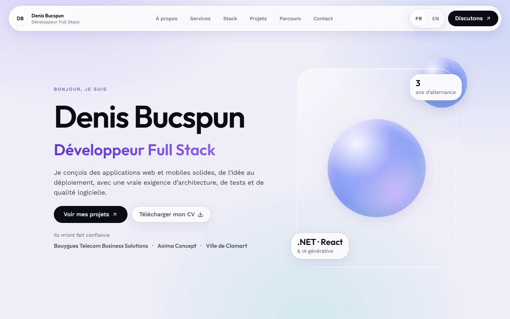

# Portfolio de Denis Bucspun

Portfolio full-stack au style « Liquid Glass », bilingue FR/EN, avec un hero cinématique (avatar 3D, vidéo, repli statique) et un CMS intégré pour gérer projets, technologies, parcours et textes sans toucher au code.

Le contenu est visible sans JavaScript : la couche cinématique (GSAP, Lenis, Three.js) est strictement optionnelle, et chaque média a un repli.



## Stack

| Domaine         | Choix                                                                                              |
| --------------- | -------------------------------------------------------------------------------------------------- |
| Application     | Next.js 16 (App Router), React 19, TypeScript                                                      |
| CMS             | Payload CMS 3, embarqué dans l'application (`/admin`, `/api`)                                      |
| Base de données | PostgreSQL (Docker en local, Neon en production)                                                   |
| Design          | Tailwind CSS 4, tokens « Liquid Glass » (`design-system/`)                                         |
| Langues         | next-intl : `/fr` (défaut) et `/en`                                                                |
| Mouvement et 3D | GSAP, Lenis, three, React Three Fiber, drei                                                        |
| Médias          | disque local en dev, Vercel Blob en production                                                     |
| Contact         | formulaire avec anti-spam, messages enregistrés dans le CMS, notification par Resend (optionnelle) |
| Qualité         | Vitest, Playwright, axe, ESLint, Prettier                                                          |
| Outillage       | pnpm 10, Node 22, Docker, GitHub Actions                                                           |

## Démarrage en 6 commandes

Prérequis : Node 22 (`.nvmrc`), pnpm 10 (`corepack enable`) et Docker.

```bash
pnpm i
cp .env.example .env     # puis remplace PAYLOAD_SECRET et IP_HASH_SALT par des valeurs aléatoires
pnpm db:up               # Postgres 17 dans Docker, attend qu'il soit prêt
pnpm migrate             # crée le schéma
pnpm seed                # charge le contenu issu des CV
pnpm dev                 # http://localhost:3000/fr
```

Le premier compte administrateur se crée sur `http://localhost:3000/admin` (voir [`docs/cms-guide.md`](docs/cms-guide.md)).

## Scripts

| Script                                                  | Rôle                                                                                                                                               |
| ------------------------------------------------------- | -------------------------------------------------------------------------------------------------------------------------------------------------- |
| `pnpm dev`                                              | serveur de développement                                                                                                                           |
| `pnpm build`                                            | build de production (la base doit être joignable, sauf si `SKIP_BUILD_STATIC=1`)                                                                   |
| `pnpm build:prod`                                       | `payload migrate` puis `next build` (déploiement)                                                                                                  |
| `pnpm start`                                            | sert le build de production (Next signale que `output: 'standalone'` préfère `node .next/standalone/server.js` : sans effet sur le fonctionnement) |
| `pnpm typecheck`                                        | `tsc --noEmit`                                                                                                                                     |
| `pnpm lint`                                             | ESLint, dont les règles de couches et de clean code                                                                                                |
| `pnpm format`                                           | Prettier sur tout le dépôt (à éviter : préfère cibler les fichiers modifiés avec `pnpm exec prettier --write <fichiers>`)                          |
| `pnpm test`                                             | tests unitaires (Vitest)                                                                                                                           |
| `pnpm test:watch`                                       | tests unitaires en continu                                                                                                                         |
| `pnpm test:int`                                         | tests d'intégration, contre Postgres (`pnpm db:up` et `pnpm migrate` d'abord)                                                                      |
| `pnpm e2e:install`                                      | installe Chromium pour Playwright                                                                                                                  |
| `pnpm e2e`                                              | tests de bout en bout (il faut un build : `pnpm build` d'abord)                                                                                    |
| `pnpm db:up` / `pnpm db:down`                           | démarre / arrête Postgres (`docker compose`)                                                                                                       |
| `pnpm payload`                                          | CLI Payload                                                                                                                                        |
| `pnpm generate:types`                                   | régénère `payload-types.ts` après un changement de schéma                                                                                          |
| `pnpm generate:importmap`                               | régénère l'import map de l'admin                                                                                                                   |
| `pnpm migrate`                                          | applique les migrations                                                                                                                            |
| `pnpm migrate:create`                                   | crée une migration après un changement de schéma                                                                                                   |
| `pnpm seed`                                             | charge (ou recharge) le contenu de départ, voir l'avertissement de [`docs/deploy.md`](docs/deploy.md#charger-le-contenu-de-départ)                 |
| `pnpm media:optimize:glb` / `pnpm media:optimize:video` | optimisent l'avatar 3D et les vidéos (voir [`docs/higgsfield`](docs/higgsfield/README.md))                                                         |
| `pnpm media:fixture`                                    | régénère l'avatar de test `public/fixtures/avatar-fixture.glb`, utilisé par les E2E                                                                |

## Structure

Clean Architecture adaptée : les dépendances ne pointent que vers l'intérieur.

```
src/
├─ domain/          règles métier pures, aucun import (types immuables, fonctions pures)
├─ application/     cas d'usage et ports (interfaces), dépend du domaine seulement
├─ infrastructure/  adaptateurs des ports : Payload (collections, globals, migrations), Resend, icônes, seed
├─ composition/     racine de composition : relie les ports à leurs adaptateurs
├─ presentation/    composants, design, i18n (messages FR/EN), cinématique, styles
└─ app/             routes Next.js minces, server actions, admin et API Payload
tests/              unit (miroir des couches), integration, e2e, support (fakes en mémoire)
scripts/media/      optimisation GLB et vidéo
design-system/      tokens et règles de design
docs/               guide du CMS, déploiement, pack Higgsfield, rapport qualité, capture d'écran
```

La règle de dépendance est appliquée par ESLint (`pnpm lint`) et par `tests/unit/architecture.test.ts`. Une page appelle un seul cas d'usage via `@/composition` puis passe des données aux composants : aucun composant ne connaît Payload ni la base.

## Variables d'environnement

Copie `.env.example` vers `.env` (jamais commité).

| Variable                | Rôle                                                                                                                                                                                                      |
| ----------------------- | --------------------------------------------------------------------------------------------------------------------------------------------------------------------------------------------------------- |
| `DATABASE_URI`          | connexion Postgres                                                                                                                                                                                        |
| `PAYLOAD_SECRET`        | secret Payload, 32 caractères aléatoires minimum                                                                                                                                                          |
| `PAYLOAD_DB_PUSH`       | `true` : le schéma suit automatiquement les collections en dev (Payload demande alors une confirmation au prochain `pnpm migrate`) ; `false` ou absente : migrations seules, comme en CI et en production |
| `NEXT_PUBLIC_SITE_URL`  | URL publique, sans `/` final : canonical, sitemap, `robots.txt`, JSON-LD. Figée dans le build                                                                                                             |
| `IP_HASH_SALT`          | sel du hachage d'IP du formulaire de contact                                                                                                                                                              |
| `BLOB_READ_WRITE_TOKEN` | active Vercel Blob pour les médias (sinon dossier `media/`)                                                                                                                                               |
| `RESEND_API_KEY`        | active la notification e-mail du formulaire (sinon les messages sont seulement enregistrés)                                                                                                               |
| `CONTACT_FROM`          | expéditeur des notifications                                                                                                                                                                              |
| `CONTACT_TO`            | destinataire de repli (le champ « contactTo » du CMS prime)                                                                                                                                               |
| `SEED_PHONE`            | téléphone injecté par le seed, uniquement sur ta machine : il n'est jamais commité                                                                                                                        |
| `NEXT_PUBLIC_E2E`       | build de test uniquement : active l'avatar de fixture `?__fixture=avatar`. Jamais en production                                                                                                           |
| `SKIP_BUILD_STATIC`     | `1` : le build ne pré-rend aucune page et n'a pas besoin de base (utilisé par le `Dockerfile`)                                                                                                            |
| `E2E_CHROMIUM_PATH`     | chemin optionnel d'un Chromium préinstallé pour Playwright                                                                                                                                                |

## Tests

```bash
pnpm typecheck && pnpm lint && pnpm test      # rapide, sans base
pnpm db:up && pnpm migrate && pnpm test:int   # avec Postgres
pnpm build && pnpm e2e                        # build de production puis Playwright
```

Les E2E tournent sur quatre viewports (1440, 1024, 768 et 375 px). Les mesures Lighthouse, axe et les budgets sont dans [`docs/quality-report.md`](docs/quality-report.md). L'intégration continue ([`.github/workflows/ci.yml`](.github/workflows/ci.yml)) rejoue toute cette chaîne sur chaque pull request et sur `main`.

## Pipeline média

L'avatar Memoji 3D et les vidéos du hero se produisent avec Higgsfield, puis s'optimisent et se déposent dans le CMS : tout est décrit pas à pas dans [`docs/higgsfield`](docs/higgsfield/README.md). Sans média, le site affiche une orbe de verre.

## Documentation

- [`docs/cms-guide.md`](docs/cms-guide.md) : gérer le contenu depuis `/admin`
- [`docs/deploy.md`](docs/deploy.md) : Vercel, Neon, Vercel Blob, Resend, ou Docker
- [`docs/higgsfield`](docs/higgsfield/README.md) : média cinématique
- [`docs/quality-report.md`](docs/quality-report.md) : Lighthouse, axe, E2E

## Conventions de commit

[Conventional Commits](https://www.conventionalcommits.org/) en anglais, à l'impératif : `feat(contact): add layered contact flow`, `fix(ui): make the floating nav fit at tablet widths`, `docs: ...`, `chore: ...`, `test: ...`, `refactor: ...`. Un commit par changement cohérent.

## Licence

Tous droits réservés. Le code, les textes et les médias de ce dépôt ne peuvent être réutilisés sans l'accord de l'auteur.
